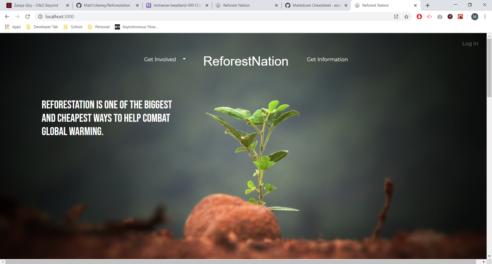
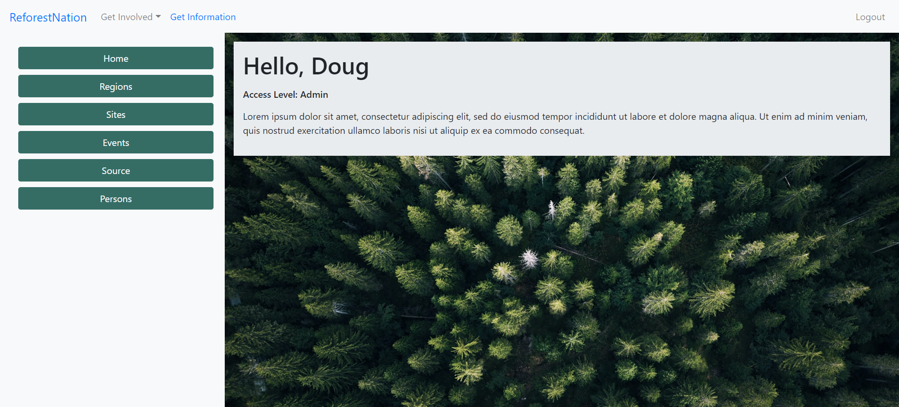
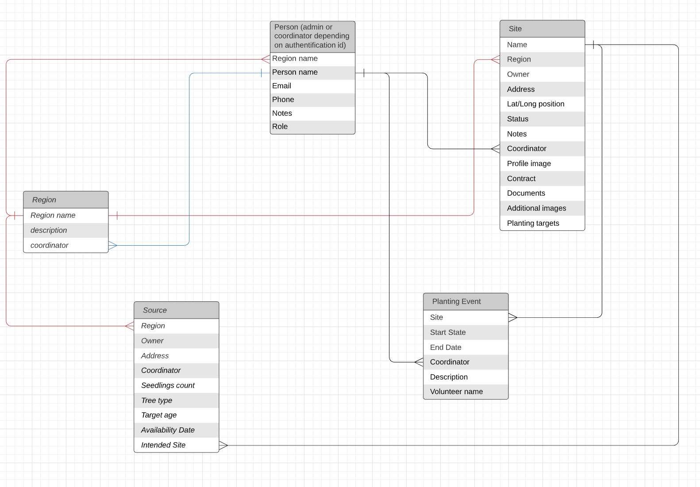
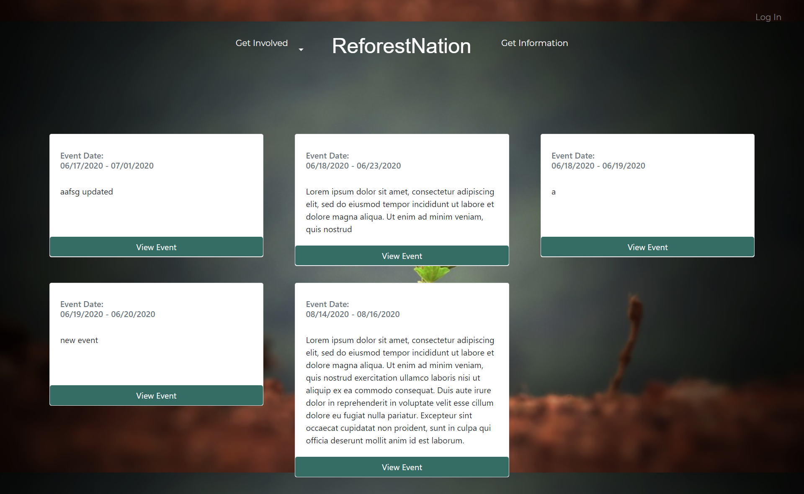
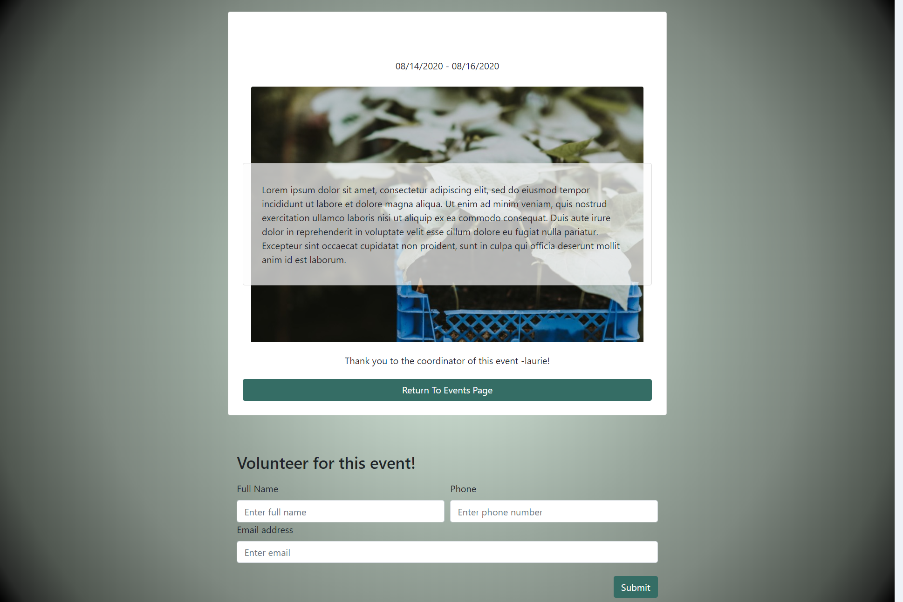

# ReforestNation
### [Visit our Live Site!](https://immense-headland-09512.herokuapp.com/ "ReforestNation")

  This application serves as a tool to help organize events for tree planting. The application supports making events in only the United States. When a volunteer enters the site they can travel to the "Get Involved" page to give them a little insight on how and why to join. They can then look at events and volunteer for a certain event by filling out a simple form. That form will then be sent to the coodinator that had organized the event and will reach out to the volunteer. 
  
  Understanding these events will require a lot of action without the use of a computer, we tried to make it as easy as possible to help get people out there and plant!

# Our Site

Using Mongoose with MongoDB, we created a system that allows events, regions, sites, coordinators, and volunteers to be organized as such.

### Each Coordinator Has 
- Regions
    * Land owner
    * Site coordinates
    * Status

- Events
  * Site
  * Start and end date
  * Description
  * Coordinator
  * List of volunteers

### Each Source Has
- Region
- Seedlings
- Availability Date
- Target area

# For the Volunteers

We aim to really capture their interest and get them inspired to reach out and help!

The volunteer can look at the events that are happening and can find one that is near where they reside.

Here we allow the volunteer to observe the updates of this event and fill out a simple form to reach out to a coordinator to join the cause!

## The Tech That We Used
 
 
 
 
 
 
 
 
 
 
 
 
 
 
 
 
 
 
 
 
 
 
 
 

 # Other Tech Services

  We used AWS to help with storing images. Multer we used to help with handling images being uploaded. Nodemailer is meant to send an email to users as a welcome to ReforestNation.

  We used CanvasJS for the map that is shown on our information page to show statistics in why it is so important to really get out there and plant some trees!

  # Collaborators

  
  

  
  